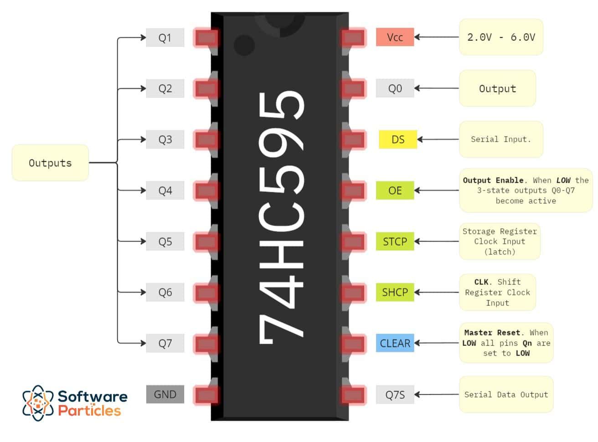
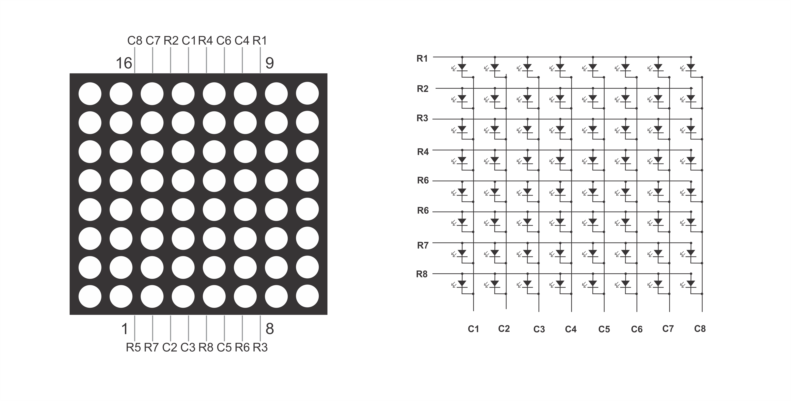

# Arduino 8x8 LED Matrix Display with 74HC595

## Description
This project controls an 8x8 LED matrix using a 74HC595 shift register.  
It demonstrates how to display patterns, characters, and dynamic animations on the matrix by manipulating rows and columns through an Arduino.

Key features:
- Control individual pixels
- Simple animations: diagonals, moving lines
- Scrolling numbers and letters

---

## Hardware Components
- Arduino UNO / Nano (ATmega328P)
- 8x8 LED Matrix
- 74HC595 Shift Register
- Resistors for columns/rows (if needed)
- Jumper wires / breadboard

---

## Pinout

| Component           | Arduino Pin |
|--------------------|------------|
| LATCH (74HC595)    | 12         |
| CLOCK (74HC595)    | 13         |
| DATA (74HC595)     | 11         |
| Rows 0 → 7         | 2 → 9      |

---

## Main Functions

### `LedMatrix_SetupMatrixPins(latchPin, dataPin, clockPin, rowPins, matrixSize)`
Configures the Arduino and 74HC595 pins for controlling the matrix.

### `LedMatrix_SetPixel(col, row)`
Lights up a single pixel at the specified column and row.  
Uses a short `delayMicroseconds` to maintain visibility of the pixel.

### `LedMatrix_SetCols(value)` / `LedMatrix_SetRows(value)`
Sets all columns or rows at once.  
- `SetCols` controls the columns directly via Arduino pins  
- `SetRows` controls the rows via the 74HC595 shift register

### `LedMatrix_DisplayFrame(data, totalCols, matrix_size, image_display_interval)`
- Displays a sequence of data (characters or patterns) on the matrix  
- Enables horizontal scrolling across the matrix columns

---

## Example Animations in Code
1. Light up all pixels one by one  
2. Animate diagonals  
3. Moving line from left to right (horizontal and vertical)  
4. Scroll numbers and letters (`0-9`, `A-F`)

---

## GIF Demo
> In the GIF you can see:  
- Individual pixels being lit  
- Animated diagonals  
- Moving lines across the matrix  
- Scrolling characters  

)

| 74HC595 Wiring | 8x8 LED Matrix Wiring |
|----------------|----------------------|
|  |  |

---

## Notes
- Bit order in `shiftOut` affects the vertical orientation of the image (`LSBFIRST` = top-up, `MSBFIRST` = bottom-up)  
- Small delays (`delayMicroseconds`) are necessary to maintain visibility of individual pixels

